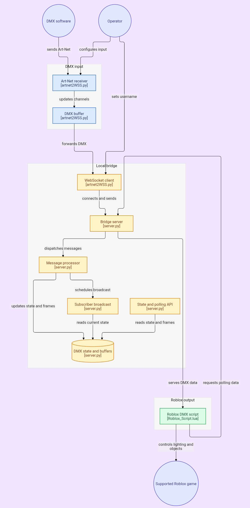

# 🎛️ Art-Net → Roblox DMX Bridge

**Kontrol lampu/DMX di dalam game Roblox secara real-time**, langsung dari software DMX seperti **MA3**, **QLC+**, atau **MagicQ**. ✨

Sinyal dari console/software DMX-mu akan diteruskan ke game Roblox, sehingga lampu di dunia nyata bisa ditiru langsung di dalam game.

---

## 📚 Daftar Isi

1. [⚠️ Peringatan Penting](#️-peringatan-penting)
2. [🧩 Cara Kerja](#-cara-kerja)
3. [📁 Isi Folder](#-isi-folder)
4. [🎮 Game yang Didukung](#-game-yang-didukung)
5. [🖥️ Yang Dibutuhkan](#️-yang-dibutuhkan)
6. [⚙️ Instalasi](#️-instalasi)
7. [🚀 Cara Menjalankan](#-cara-menjalankan)
8. [🔧 Konfigurasi](#-konfigurasi)
9. [💡 Fixture MagicQ](#-fixture-magicq)
10. [❓ Masalah Umum](#-masalah-umum)
11. [📄 Lisensi](#-lisensi)

---

## ⚠️ Peringatan Penting

Script `Roblox_Script.lua` dijalankan pakai **tool pihak ketiga** (bukan cara resmi dari Roblox). Sebelum coba, pahami ini:

- 🚫 Akunmu **bisa kena banned/suspend** sewaktu-waktu.
- 🔒 Tool pihak ketiga (apalagi yang gratis) **bisa mengandung malware**. Unduh hanya dari sumber yang kamu percaya.
- 🔴 **Gunakan akun cadangan**, jangan akun utama.

**Kami tidak merekomendasikan metode ini** dan tidak bertanggung jawab apabila akunmu kena ban atau hilang. Metode lain yang lebih aman sedang dikembangkan, tapi belum ada kepastian kapan akan rilis.

Proyek ini dibagikan apa adanya untuk keperluan pribadi/eksperimen. Segala risiko (banned, hilang data, dll.) sepenuhnya tanggung jawab pengguna sendiri.

---

## 🧩 Cara Kerja

Ada 3 komponen yang jalan berurutan: **input DMX** (di PC-mu) → **bridge lokal** (server + client WebSocket) → **output Roblox** (polling via HTTP).



Alur singkatnya:

1. **`artnet2WSS.py`** (GUI) menerima paket Art-Net dari software DMX-mu, menyimpannya ke buffer channel, lalu meneruskannya lewat WebSocket ke `server.py`. Di sini juga kamu mengatur **Username** Roblox target.
2. **`server.py`** menerima data dari client WebSocket, memprosesnya lewat *message processor*, menyimpan state & frame terbaru, dan menyiapkannya untuk dua konsumen: broadcast ke subscriber WebSocket dan endpoint HTTP polling.
3. **`Roblox_Script.lua`** (jalan di dalam game) melakukan polling HTTP ke `server.py` untuk mengambil data state/frame terbaru, lalu memicu perubahan lampu/objek di game secara real-time.

```
Software DMX (MA3 / QLC+ / MagicQ)
        ▼  kirim sinyal Art-Net (UDP :6454)
artnet2WSS.py  (GUI, terima Art-Net + kirim username)
        ▼  WebSocket (ws://127.0.0.1:5311)
server.py  (bridge server: state, buffer, broadcast, polling API)
        ▼  HTTP polling (/state, /polling)
Roblox_Script.lua  (jalan di dalam game)
        ▼
Lampu/objek di Roblox menyala & bergerak real-time ✨
```

---

## 📁 Isi Folder

| File/Folder | Fungsi |
|------|--------|
| `artnet2WSS.py` | Aplikasi GUI: menerima Art-Net di PC-mu dan meneruskannya ke server via WebSocket |
| `server.py` | Bridge server lokal: menyimpan state DMX, broadcast ke subscriber, dan menyediakan HTTP polling API untuk Roblox |
| `Roblox_Script.lua` | Script yang dijalankan di dalam game Roblox, polling data dari `server.py` |
| `Fixtures/MagicQ/*.hed` | Profil fixture DMX (Blinder, Flower, Parled, Strobe, Wallwasher, dll.) untuk diimpor ke software **MagicQ** |
| `requirements.txt` | Daftar library Python yang dibutuhkan |
| `1_INSTALL_DEPENDENSI.bat` | Klik untuk install semua library otomatis (Windows) |
| `2_JALANKAN_SERVER.bat` | Klik untuk menjalankan `server.py` (Windows) |
| `3_JALANKAN_ARTNET2WSS.bat` | Klik untuk membuka aplikasi `artnet2WSS.py` (Windows) |
| `START_SEMUA.bat` | Klik sekali untuk install + jalankan semuanya (Windows, paling praktis) |

---

## 🎮 Game yang Didukung

| Game | Studio |
|------|--------|
| [Clarity Over Resonance](https://www.roblox.com/games/18218605381/Clarity-Over-Resonance) | Beyond Clarity Studio |

---

## 🖥️ Yang Dibutuhkan

- Windows, macOS, atau Linux
- Python 3.11+ → [Download di sini](https://www.python.org/downloads/)
- Roblox terinstal
- Tool/script runner pihak ketiga yang mendukung `http_request` (lihat peringatan di atas)
- Software DMX (MA3, QLC+, MagicQ, dll)

---

## ⚙️ Instalasi

1. Install Python dari [python.org](https://www.python.org/downloads/) — saat instalasi, centang **"Add Python to PATH"**.
2. Install library yang dibutuhkan. Cara termudah: **double-click `1_INSTALL_DEPENDENSI.bat`**.
   - Atau lewat Command Prompt: `pip install -r requirements.txt`

---

## 🚀 Cara Menjalankan

**Cara tercepat (Windows):**
1. Double-click `START_SEMUA.bat`
2. Isi Username di jendela yang terbuka
3. Buka Roblox, jalankan `Roblox_Script.lua` lewat tool-mu

**Catatan:** Satu server hanya untuk satu server Roblox. Jangan pakai server yang sama untuk 2 server Roblox berbeda.

**Cara manual:**
1. Jalankan `python server.py` — biarkan tetap terbuka
2. Jalankan `python artnet2WSS.py`, isi Username, pastikan indikator **WebSocket** dan **Art-Net** menyala hijau
3. Buka Roblox, jalankan `Roblox_Script.lua` lewat tool-mu
4. Arahkan output Art-Net dari software DMX-mu ke IP `127.0.0.1`, port `6454`

Untuk menghentikan script di Roblox, jalankan:
```lua
_G.ResetSpesificScripts = true
```

---

## 🔧 Konfigurasi

Beberapa nilai bisa diubah langsung di bagian atas `server.py`:

| Variabel | Default | Keterangan |
|----------|---------|------------|
| `SERVER_HOST` | `0.0.0.0` | Alamat bind server |
| `SERVER_PORT` | `5311` | Port WebSocket & HTTP |
| `POLLING_FRAMES` | `100` | Jumlah frame yang disimpan untuk tiap polling request |
| `BROADCAST_INTERVAL` | `0.033` (~30fps) | Interval throttle broadcast ke subscriber WebSocket |

Endpoint yang disediakan `server.py`:

| Endpoint | Tipe | Fungsi |
|----------|------|--------|
| `/` atau `/ws` | WebSocket | Menerima data dari `artnet2WSS.py` dan subscriber lain |
| `/state` | HTTP GET | Mengambil state DMX terkini |
| `/polling` | HTTP GET | Diambil `Roblox_Script.lua` untuk mengambil batch frame terbaru |

Art-Net dari software DMX diarahkan ke `127.0.0.1:6454` (port standar Art-Net) — sesuaikan Net/Subnet/Universe di software DMX-mu.

---

## 💡 Fixture MagicQ

Folder `Fixtures/MagicQ/` berisi profil fixture (`.hed`) siap pakai untuk software **MagicQ**: Blinder, Flower 180W, Parled, Strobe, TRF Clara S 14R, dan Wallwasher 24x3W.

Salin semua file `.hed` tersebut ke folder fixture MagicQ:

```
C:\Users\abcd\Documents\MagicQ\show\heads
```

⚠️ Fixture ini **kadang diperbarui**, jadi sesekali cek ulang repo ini untuk versi terbaru.

---

## ❓ Masalah Umum

**Server error / modul tidak ditemukan** → Jalankan `pip install -r requirements.txt`.

**Indikator WebSocket tidak hijau** → Pastikan `server.py` sudah jalan duluan, cek firewall, dan cek port `5311` tidak dipakai aplikasi lain.

**Art-Net tidak terdeteksi** → Cek IP/port (`6454`) dan Net/Subnet/Universe di software DMX-mu.

**Lampu di Roblox tidak bergerak** → Cek username sama persis, pastikan sedang di game yang didukung, dan cek `Roblox_Script.lua` berhasil polling ke `/polling`.

**Script langsung error** → Tool-mu mungkin tidak mendukung `http_request`.

---

## 📄 Lisensi

Proyek ini dibuat untuk keperluan pribadi/eksperimen. Penggunaan sepenuhnya tanggung jawab pengguna. Baca [⚠️ Peringatan Penting](#️-peringatan-penting) sebelum menggunakan.